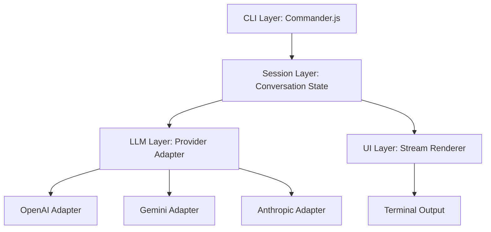

# 🔮 SEER (v0.1.0)
### High-Performance Local AI Agent Runtime

Seer is a production-grade, local-first AI CLI agent runtime designed for speed, modularity, and privacy. Built in TypeScript, it provides a stable foundation for agentic workflows, running entirely from your terminal using your own API keys.

---

## 🚀 Why Seer?
While tools like OpenCode or Claude Code exist, Seer is built with a different philosophy:

1.  **Modular Adapter Architecture**: Unlike tightly coupled runtimes, Seer uses a strict Provider Abstraction. You can swap between OpenAI, Anthropic, Gemini, or even a local Llama instance without touching the core CLI or session logic.
2.  **Stateless Core / Stateful Sessions**: Seer manages conversation state in memory for blazing-fast interactive sessions, but keeps the local filesystem clean by default.
3.  **Zero-Heavy-Frameworks**: Seer avoids heavy "agent" libraries that bloat your binary. It uses raw HTTP streaming and efficient stream parsing to deliver token-by-token responses with minimal latency.
4.  **Local-First Governance**: Your configuration (`~/.ai/config.json`) and data stay under your control.

---

## 🏗️ Architecture Overview

Seer is structured as a layered system to ensure future extensibility (Tools, Autonomy, Memory).



### Core Components:
- **`src/cli/`**: Entry point and command definitions.
- **`src/session/`**: In-memory message history and context management.
- **`src/llm/`**: The "Brain" interface. Modular adapters translate internal messages into provider-specific API calls.
- **`src/ui/`**: High-fidelity terminal rendering (typing indicators, role-based coloring).

---

## 🛠️ Getting Started

### 1. Installation
Clone the repository and link the binary:
```bash
npm install
npm run build
npm link
```

### 2. Configuration
Seer automatically initializes a configuration file at `~/.ai/config.json`.
```json
{
  "provider": "gemini",
  "model": "gemini-2.5-flash",
  "apiKey": "YOUR_API_KEY",
  "baseUrl": "https://generativelanguage.googleapis.com/v1beta"
}
```

### 3. Usage
**Single Message Mode:**
```bash
ai chat "How does consistent hashing work?"
```

**Interactive Mode:**
```bash
ai chat
```

---

## 📊 Visuals (CLI in Action)

```text
User > What is the current level of Project Seer?

AI: - Thinking...
Project Seer is currently at v0.1.0 (Foundation Layer). 
The core communication engine is stable and streaming is active.
```

---

## 🗺️ Roadmap
- [x] Phase 1: Core CLI & Streaming Foundation
- [ ] Phase 2: Local File System Tooling (Read/Write/Edit)
- [ ] Phase 3: Autonomous Agent Loop (Loop-to-Correct)
- [ ] Phase 4: Long-term Vector Memory (RAG)

---
*Created by Ankit Raj Kushwaha (@switchengeek)*
